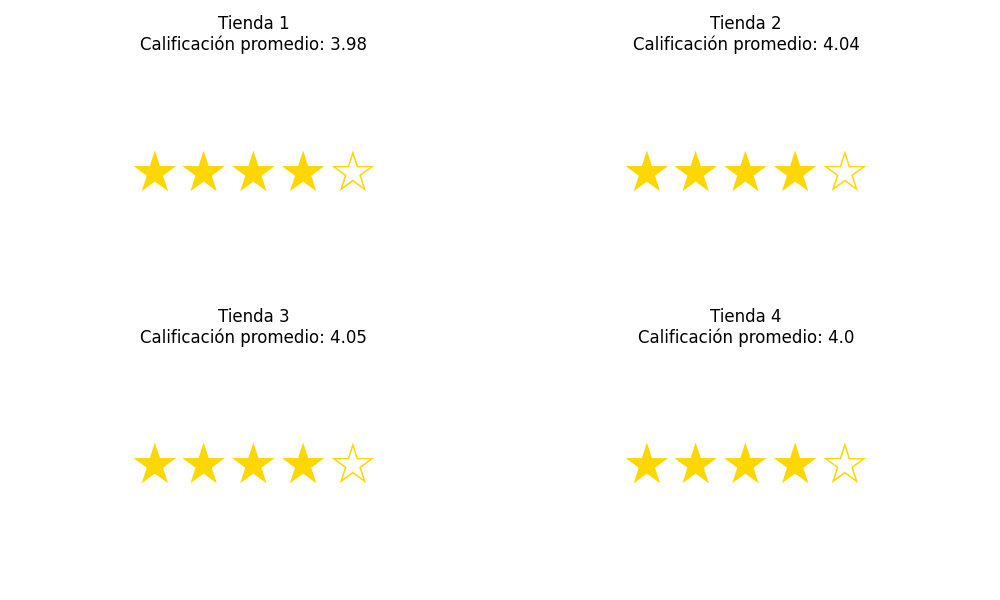

# Challenge_Alura_Store

# 📊 Análisis de Ventas de Cuatro Tiendas 

Este repositorio contiene un análisis exploratorio de datos (EDA) realizado sobre las ventas de cuatro tiendas distintas en Latinoamérica. El objetivo es descubrir patrones de comportamiento, identificar los productos más vendidos y evaluar el rendimiento de cada tienda para apoyar decisiones comerciales.

---

## 🎯 Propósito del Análisis

El análisis busca responder preguntas como:

- ¿Cuál es la tienda con mayores ventas?
- ¿Qué productos y categorías se venden más?
- ¿Cuál tienda tiene mejor calificación promedio por parte de los clientes?
- ¿Cómo se distribuyen geográficamente las ventas?
- ¿Qué recomendaciones se pueden dar basadas en estos datos?

Este estudio puede ayudar a enfocar estrategias de marketing, mejorar la logística y tomar decisiones sobre expansión o inversión.

---

## 🗂️ Estructura del Proyecto
📁 proyecto-analisis-ventas │ ├── 📊 informe_ventas.ipynb # Jupyter Notebook principal con el análisis ├── 📁 imagenes/ # Carpeta con los gráficos generados (.png) │ ├── grafico_ventas_tienda1.png │ ├── grafico_estrellas_calificacion.png │ └── ... ├── 📁 datos/ # (opcional) Carpeta para CSVs si decides descargarlos localmente │ └── tienda_1.csv ├── README.md # Este archivo


---

## 📈 Ejemplos de Gráficos e Insights

### ⭐ Calificación Promedio por Tienda


### 📦 Productos más vendidos por tienda


- **La Tienda 3** muestra las mayores ventas generales.
- **La categoría "Accesorios"** es la más popular en todas las tiendas.
- Las tiendas con mejor calificación promedio son candidatas ideales para reforzar campañas de fidelización.

---

## ⚙️ Instrucciones para Ejecutar el Notebook

1. **Clona el repositorio**:
   ```bash
   git clone https://github.com/tu_usuario/proyecto-analisis-ventas.git
   cd proyecto-analisis-ventas

2. **Instala las dependencias necesarias (puedes usar un entorno virtual):**
    pip install -r requirements.txt

3. **Abre el Jupyter Notebook:**
  jupyter notebook informe_ventas.ipynb

4. **Ejecuta las celdas paso a paso para ver el análisis y los gráficos generados.**

#📌 Notas
Los datos fueron obtenidos desde un repositorio público de Alura Latam.

Todos los gráficos están generados automáticamente en el notebook y guardados como imágenes en la carpeta imagenes/.

#📬 Contacto
Si tienes dudas o sugerencias, no dudes en abrir un issue o enviarme un mensaje.

